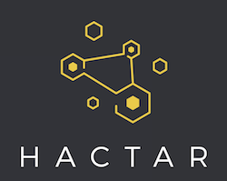

# Hactar backend

> Node.js application for Hactar API.

This repository contains API implementation for Hactar, a Filecoin mining analyzer.

## Development

### Requirements

Following software is required to be installed to use this repo:
 * [NodeJs](https://nodejs.org/en/) >= v8.4.0
 * [Yarn](https://yarnpkg.com/en/docs/install#debian-stable)
 * Docker
 * docker-compose

### Usage

Make sure to run `yarn install` before first build or
each time you change dependencies in package.json.

On first use of this repo, run `npx task build` which will
build docker image.You will have to run `npx task build` each time
you change dependencies in package.json (yarn.lock).

Run `npx task --help` to see all available commands and their description.

### Notice
* make sure you update yarn.lock before building
* use sequelize-cli local to generate migrations (because of timestamp)

## Documentation

The documentation can be accessed on `app-url:${SWAGGER_DOCS_PORT}/${SWAGGER_DOCS_URL}`

> e.g. _http://localhost:8080/api/swagger/_

- default docs url: `/api/swagger`
- default docs port: `8080`

## License

This project is dual-licensed under Apache 2.0 and MIT terms:
- Apache License, Version 2.0, ([LICENSE-APACHE](LICENSE-APACHE) or http://www.apache.org/licenses/LICENSE-2.0)
- MIT license ([LICENSE-MIT](LICENSE-MIT) or http://opensource.org/licenses/MIT)

